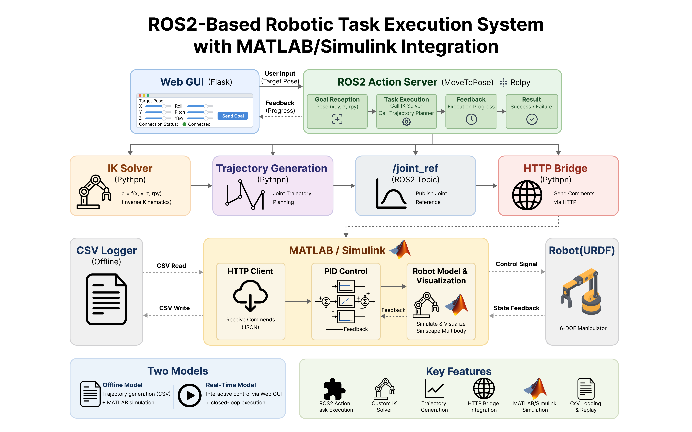
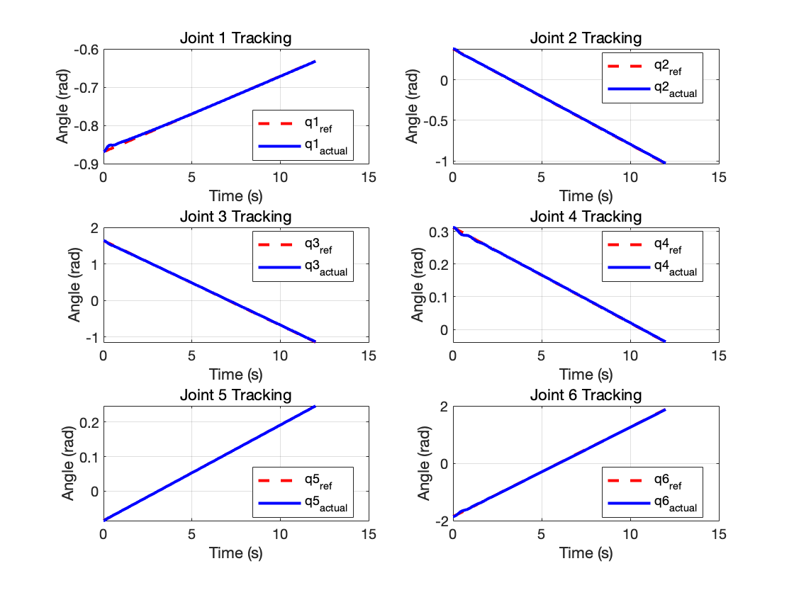
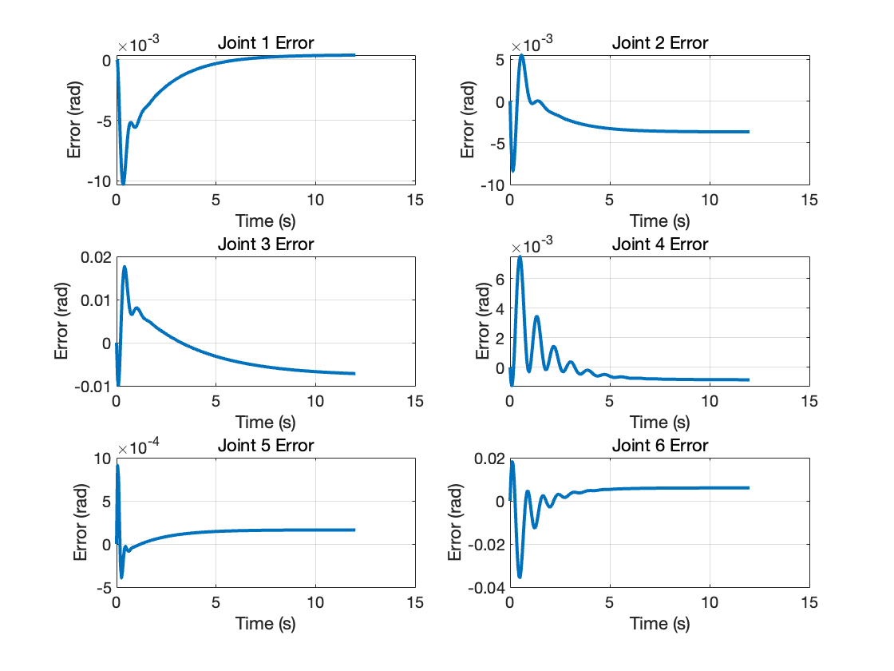

# ROS2-Based Robotic Task Execution System with MATLAB Integration

A ROS2-based robotic control system that bridges high-level task planning and low-level joint control, with real-time MATLAB/Simulink integration.

## Demo (Real-Time + Offline)

The system supports both real-time control and offline trajectory simulation:

- **Real-time mode**: interactive control via Web GUI with live MATLAB response  
- **Offline mode**: trajectory generation and replay with tracking analysis  

Click the thumbnails to watch full demo videos:

### Offline Mode (Trajectory Generation + MATLAB Simulation)
[](https://youtu.be/54vFBiX_kls)

### Real-Time Mode (ROS2 + Web GUI + MATLAB Integration)
[](https://youtu.be/jeSNi3DXFD4)

## Highlights

- ROS2 Action-based asynchronous task execution  
- Custom inverse kinematics solver with velocity-constrained trajectory generation  
- Real-time ROS2 ↔ MATLAB/Simulink integration via HTTP bridge
- Achieved ~10⁻³ rad tracking accuracy in closed-loop simulation

---

## Technical Details (For Engineers)

The following sections describe system architecture, execution flow, and reproducibility in detail.

## Why This Project Matters

This project implements a complete robotic control pipeline from task-level commands to joint-level execution.

It focuses on:
- System integration (ROS2 + MATLAB)
- Real-time control pipeline
- Modular robotics architecture

## Overview

This project implements a robotic control pipeline combining ROS2, inverse kinematics, trajectory planning, and MATLAB/Simulink simulation for a 6-DOF manipulator.

It supports both offline trajectory simulation and real-time interactive control.

The system covers the full pipeline from task-level pose input to joint-level execution.



---

## Key Features

- ROS2 action-based task execution (`MoveToPose`)
- Custom IK solver (least-squares, multi-initial guess)
- Velocity-constrained joint trajectory generation
- Flask-based web GUI for pose control
- MATLAB/Simulink closed-loop simulation
- CSV-based offline trajectory replay and evaluation

---

## Tested Environment

Tested with:
- ROS2 Jazzy
- Python 3.12
- MATLAB/Simulink
- Simscape Multibody
- NumPy / SciPy / Flask

---

## Execution Flow

The system operates in two modes: offline trajectory simulation and real-time control.
The pipelines below illustrate how data flows through each mode.

### Offline Mode

#### Pipeline

1. Send target pose via GUI  
2. ROS2 generates joint trajectory (CSV)  
3. MATLAB runs simulation (`run_full_demo.m`)  
4. Tracking and error plots are generated  

#### Simulation Result





---

### Real-Time Mode

#### Pipeline

1. Adjust pose via GUI sliders  
2. ROS2 computes IK and publishes joint references  
3. MATLAB reads reference via HTTP  
4. Robot responds in real time  

---

## Project Structure

```text
.
├── matlab/
│   ├── get_joint_ref_http.m
│   ├── pid_control.slx
│   ├── run_full_demo.m
│   └── trajectory/
│       └── .gitkeep
├── ros2_ws/
│   ├── robot_interfaces/
│   │   ├── CMakeLists.txt
│   │   ├── action/
│   │   │   └── MoveToPose.action
│   │   └── package.xml
│   └── robot_task_manager/
│       ├── package.xml
│       ├── resource/
│       │   └── robot_task_manager
│       ├── robot_task_manager/
│       │   ├── __init__.py
│       │   ├── ik_solver_opt.py
│       │   ├── joint_ref_bridge.py
│       │   ├── joint_state_publisher_node.py
│       │   ├── pose_web_gui.py
│       │   └── robot_task_manager.py
│       ├── setup.cfg
│       └── setup.py
├── urdf/
│   └── gluon_6l3.urdf
├── media/
│       ├── architecture.png
│       ├── error.png
│       ├── offline_demo.gif
│       ├── online_demo.gif
│       └── tracking.png
├── .dockerignore
├── .gitignore
├── Dockerfile
├── README.md
└── requirements.txt
```

## How to Run

### Quick Start (Docker - Recommended)

This project is designed to run using Docker for full reproducibility.

#### 1. Build Docker Image

```bash
docker build -t ros2-matlab-robot-system .
```

#### 2. Run Container (with workspace mounted)

```bash
docker run -it --name ros2_robot_demo \
  -p 8080:8080 \
  -p 5002:5002 \
  -v "$(pwd)":/root/ros2_study/workspace \
  ros2-matlab-robot-system
```

#### 3. Inside Container

```bash
source /opt/ros/jazzy/setup.bash
cd /root/ros2_study/workspace/ros2_ws
colcon build
source install/setup.bash
```

After setup, follow the instructions in the Real-time or Offline sections below.

---

### Manual Setup (Without Docker)

This project also supports manual setup if Docker is not used.

This project supports two execution modes:
	•	Real-time Mode (Recommended): Interactive control via Web GUI + ROS2 + MATLAB
	•	Offline Mode: Trajectory generation (CSV) + MATLAB simulation
  
#### 1. Install Dependencies

From the project root:

```bash
pip install -r requirements.txt
```

#### 2. Build ROS2 Workspace

```bash
cd ros2_ws
colcon build
source install/setup.bash
```

#### 3. Minimal System Check (Recommended)

Before running the full system, verify that the HTTP bridge works:

```bash
ros2 run robot_task_manager joint_ref_bridge
```

Open in browser:

```
http://localhost:5002/joint_ref
```

Expected output:

```
[0.0, 0.0, 0.0, ...]
```

If this works, the ROS2–MATLAB communication layer is ready.

---

## Real-time Mode (Recommended)

### Terminal 1 — Task Manager

```bash
cd ros2_ws
source install/setup.bash
ros2 run robot_task_manager robot_task_manager
```

### Terminal 2 — Web GUI

```bash
cd ros2_ws
source install/setup.bash
ros2 run robot_task_manager pose_web_gui
```

### Terminal 3 — HTTP Bridge

```bash
cd ros2_ws
source install/setup.bash
ros2 run robot_task_manager joint_ref_bridge
```

### Browser

Open:

```
http://localhost:8080
```

Use sliders to adjust target pose (XYZ / RPY), then click Send Goal

### MATLAB Side

1. Open:

matlab/pid_control.slx

2. Configure Simulink:

- Solver type: `Fixed-step`
- Solver: `ode4 (Runge-Kutta)`
- Fixed-step size: `0.001`
- Stop time: `inf`

3. Run the model

MATLAB reads real-time joint references using:

```matlab
webread('http://localhost:5002/joint_ref')
```

---

## Offline Mode

### Step 1 — Generate trajectory (ROS2)

Run in separate terminals:

```bash
cd ros2_ws
source install/setup.bash
ros2 run robot_task_manager robot_task_manager
ros2 run robot_task_manager pose_web_gui
```

Open browser:

```
http://localhost:8080
```

Send a target pose.

This will generate:

```
matlab/trajectory/trajectory_log_6dof.csv
```

Make sure the Simulink solver settings match those described above.

### Step 2 — Run MATLAB Simulation

In MATLAB:

```matlab
run('matlab/run_full_demo.m')
```

The system will replay the trajectory and generate tracking and error plots.

---

## Alternative Verification (No MATLAB Required)

You can verify system output without MATLAB:

```bash
curl http://localhost:5002/joint_ref
```

or

```bash
ros2 topic echo /joint_ref
```

---

## Common Issues

### Missing Python dependencies

```bash
pip install -r requirements.txt
```

### HTTP bridge not responding

Make sure the bridge is running:

```bash
ros2 run robot_task_manager joint_ref_bridge
```

### Web GUI not accessible

Check:

```code
http://localhost:8080
```

### CSV file not found (Offline Mode)

Make sure you have sent a goal via the GUI before running MATLAB.

### CSV not visible on host (Docker users)

Make sure the workspace is mounted when running the container:

-v $(pwd):/root/ros2_study/workspace

---

## System Notes

- ROS2 runs inside a Docker container
- MATLAB runs on the host machine
- Communication is implemented via HTTP (Flask-based bridge)
- For offline mode, the workspace is mounted to share trajectory CSV files
