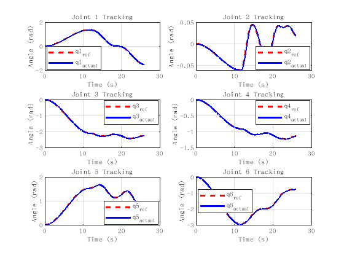
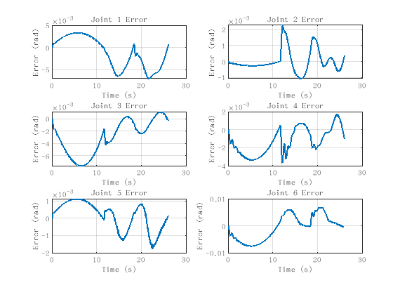
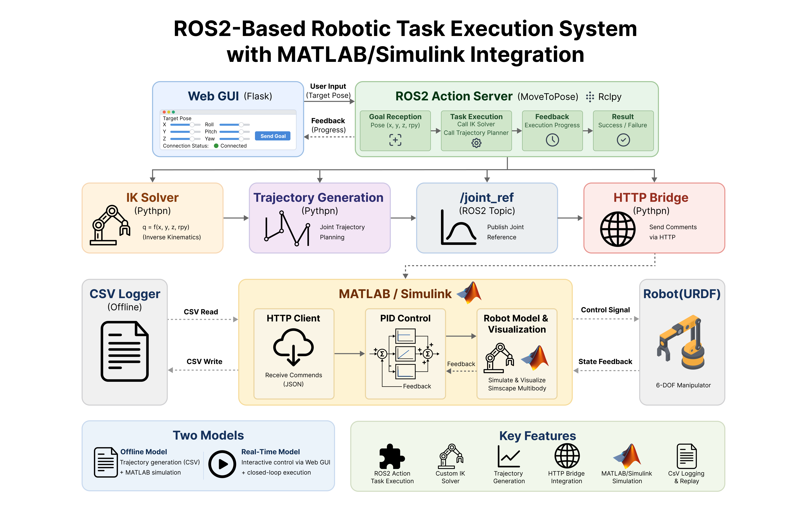
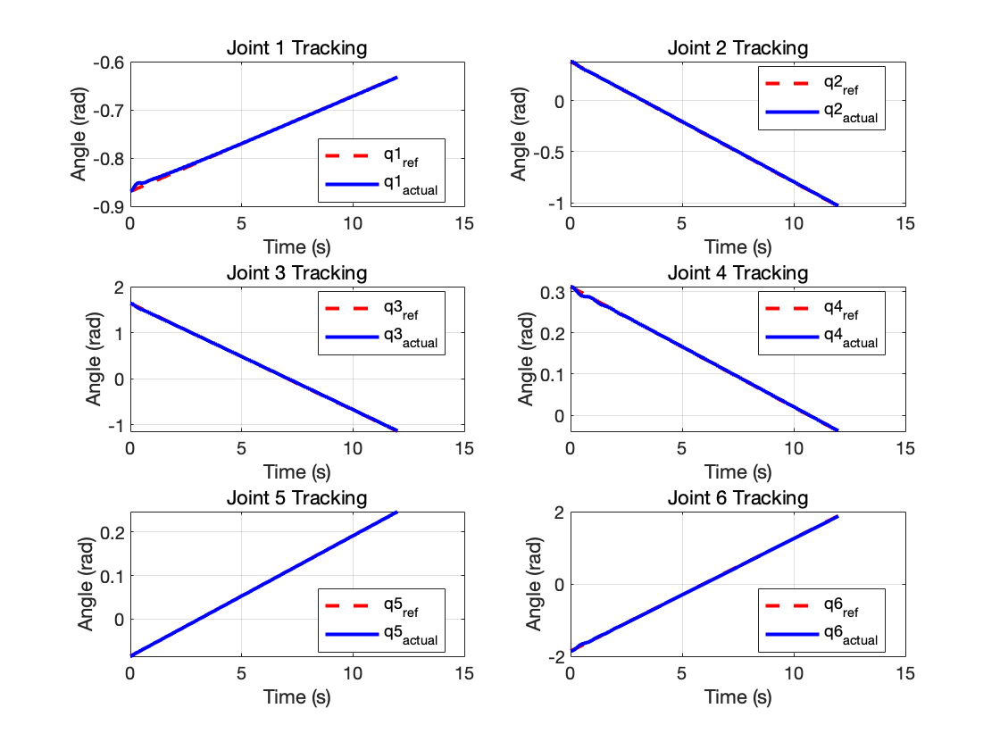
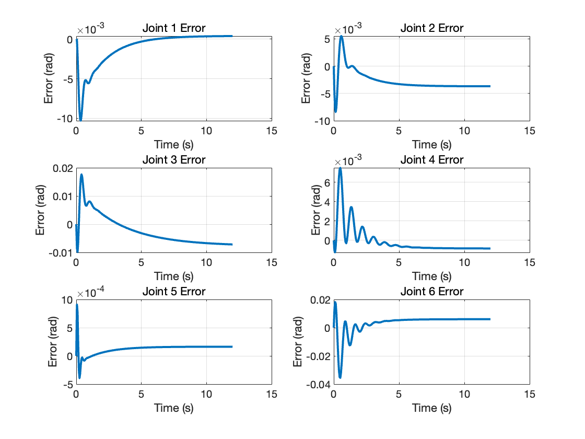

# ROS2-Based Robotic Task Execution System with MATLAB Integration

A ROS2-based robotic control system that bridges high-level task planning and low-level joint control, with real-time MATLAB/Simulink integration.

# Version 1.1 Motion Upgrade

## New Features

- Continuous Cartesian L-motion
- Seed-based IK continuity
- Mixed R/L waypoint execution
- Full sequence trajectory generation
- Improved MATLAB tracking performance

### Tracking Performance


### Joint Error


## Demo (Real-Time + Offline)

The system supports both real-time control and offline trajectory simulation:

- **Real-time mode**: interactive control via Web GUI with live MATLAB response  
- **Offline mode**: trajectory generation and replay with tracking analysis  

Click the thumbnails to watch full demo videos:

### Offline Mode (Trajectory Generation + MATLAB Simulation)
[](https://youtu.be/54vFBiX_kls)

### Real-Time Mode (ROS2 + Web GUI + MATLAB Integration)
[](https://youtu.be/jeSNi3DXFD4)

## Highlights

- ROS2 Action-based asynchronous task execution  
- Custom inverse kinematics solver with velocity-constrained trajectory generation  
- Real-time ROS2 ↔ MATLAB/Simulink integration via HTTP bridge
- Achieved ~10⁻³ rad tracking accuracy in closed-loop simulation

## Technical Details (For Engineers)

The following sections describe system architecture, execution flow, and reproducibility in detail.

## Why This Project Matters

This project implements a complete robotic control pipeline from task-level commands to joint-level execution.

It focuses on:
- System integration (ROS2 + MATLAB)
- Real-time control pipeline
- Modular robotics architecture

## Overview

This project implements a robotic control pipeline combining ROS2, inverse kinematics, trajectory planning, and MATLAB/Simulink simulation for a 6-DOF manipulator.

It supports both offline trajectory simulation and real-time interactive control.

The system covers the full pipeline from task-level pose input to joint-level execution.



## Key Features

- ROS2 action-based task execution (`MoveToPose`)
- Custom IK solver (least-squares, multi-initial guess)
- Velocity-constrained joint trajectory generation
- Flask-based web GUI for pose control
- MATLAB/Simulink closed-loop simulation
- CSV-based offline trajectory replay and evaluation

## Tested Environment

Tested with:
- ROS2 Jazzy
- Python 3.12
- MATLAB/Simulink
- Simscape Multibody
- NumPy / SciPy / Flask

## Execution Flow

The system operates in two modes: offline trajectory simulation and real-time control.

### Offline Mode

#### Pipeline

1. Send target pose via GUI  
2. ROS2 generates joint trajectory (CSV)  
3. MATLAB runs simulation (`run_full_demo.m`)  
4. Tracking and error plots are generated  

#### Simulation Result


### Real-Time Mode

#### Pipeline

1. Adjust pose via GUI sliders  
2. ROS2 computes IK and publishes joint references  
3. MATLAB reads reference via HTTP  
4. Robot responds in real time  

## Project Structure

```text
.
├── matlab/
│   ├── get_joint_ref_http.m
│   ├── pid_control.slx
│   ├── run_full_demo.m
│   └── trajectory/
│       └── .gitkeep
├── ros2_ws/
│   ├── robot_interfaces/
│   │   ├── CMakeLists.txt
│   │   ├── action/
│   │   │   └── MoveToPose.action
│   │   └── package.xml
│   └── robot_task_manager/
│       ├── package.xml
│       ├── resource/
│       │   └── robot_task_manager
│       ├── robot_task_manager/
│       │   ├── __init__.py
│       │   ├── ik_solver_opt.py
│       │   ├── joint_ref_bridge.py
│       │   ├── joint_state_publisher_node.py
│       │   ├── pose_web_gui.py
│       │   └── robot_task_manager.py
│       ├── setup.cfg
│       └── setup.py
├── urdf/
│   └── gluon_6l3.urdf
├── media/
│   ├── v1.0/
│   │   ├── tracking_v1.0.png
│   │   └── error_v1.0.png
│   └── v1.1/
│       ├── tracking_v1.1.png
│       └── error_v1.1.png
├── .dockerignore
├── .gitignore
├── Dockerfile
├── README.md
└── requirements.txt
```

## How to Run

### Quick Start (Docker - Not Verified)

> Docker for v1.1 has not been verified yet; use at your own risk.

```bash
docker build -t ros2-matlab-robot-system:v1.1 .
docker run -it --name ros2_robot_demo_v1.1   -p 8080:8080 -p 5002:5002   -v "$(pwd)":/root/ros2_study/workspace   ros2-matlab-robot-system:v1.1
```

### Single Terminal (Recommended)

```bash
cd ros2_ws
source install/setup.bash
ros2 run robot_task_manager robot_task_manager
```

Open browser: `http://localhost:8080` and use the sliders to send goals.

### MATLAB Side

1. Open `matlab/pid_control.slx`
2. Configure solver:
   - Fixed-step, `ode4 (Runge-Kutta)`
   - Step size: 0.001, Stop time: `inf`
3. Run the model to read joint references in real-time:
```matlab
webread('http://localhost:5002/joint_ref')
```

---

## Historical Version – 1.0

Old features and tracking results are preserved here:

### Tracking Performance



### Joint Error

This version used discrete R-motion only, with limited L-motion support and less smooth trajectories.




